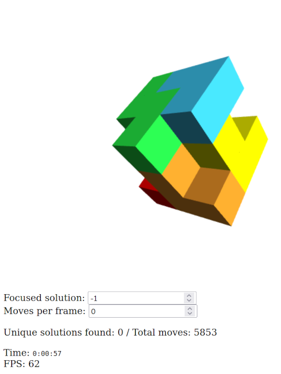

# webgl-demo

Find solutions to put together a 3x3 cube puzzle out of 7 pieces of distinct
shapes:


## Live demo

[Click here for the demo](https://a1exsh.github.io/webgl-demo/WebGL_Cube.html)



## Running locally

```{.sh}
$ google-chrome --allow-file-access-from-files ./WebGL_Cube.html
```
